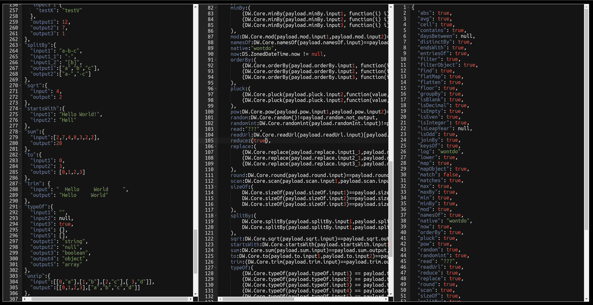

# DS-Playground

DS-Playground is a Thyme leaf application that makes it easy to 
set an input and script value to be executed by Datasonnet. It works
a lot like the Intellij plugin but provides an html interface.

* Features:
  * Autocomplete for jsonnet, DS, and DW libraries
  * Json & Json5 formatting
  * Easily accessible documentation page
  * Fast execution time
  * The ability to resize editor windows and documentation size
  * Swap between light and dark theme via query parameter
* Wanted Features:
  * Lexically analyzed auto complete
  * Ability to have multiple files in payload section, i.e. vars file



## Getting Started

When getting started with DS-Playground you have two options, you can
either pull down the existing docker image and just boot up a container
or you can clone this repository to build and run manually.

### Prerequisites

* Local  
    * [Maven](https://maven.apache.org/install.html)  
    * [Datasonnet](https://github.com/modusbox/datasonnet-mapper)   
* Docker
    * [Docker](https://docs.docker.com/get-docker/)  

### Installing

#### Local
```bash
git clone https://github.com/JakeMHughes/DS-Playground && cd DS-Playground
mvn spring-boot:run
```

#### Docker
```bash
docker pull jakeizundead/ds-playground:latest
docker run -dp 8080:8080 --rm --name=ds-playground jakeizundead/ds-playground:latest
```
## Using
The application gets deployed to port 8080 by default so to get access open up your web browser and travel
to `http://localhost:8080`.

For light mode, append the query paramater `theme=light` to the url

The left panel is the payload panel, the middle panel is your Datasonnet panel and the right panel
is a read only ouput panel
## Built With

* [Datasonnet](https://github.com/datasonnet/datasonnet-mapper) - The data transformation
* [Maven](https://maven.apache.org/) - Dependency Management
* [Ace](https://ace.c9.io/) - The code editors
* [Bootstrap](https://getbootstrap.com/)
* [jQuery](https://jquery.com/)
* [Showdown](https://github.com/showdownjs/showdown) - Markdown to HTML converter
* [js-base64](https://github.com/dankogai/js-base64) - Base64 encode functionality
* [frontend-maven-plugin](https://github.com/eirslett/frontend-maven-plugin) - Install npm packages with maven

## Contributing

Anyone is welcome to contribute, but it probably won't be an active project. I recommend creating a fork.
  
## Authors

* **Jacob Hughes** - *Initial work* - [Personal Website](https://hughesportal.com)

## License

This project is licensed under [GPLv3](https://choosealicense.com/licenses/gpl-3.0/)